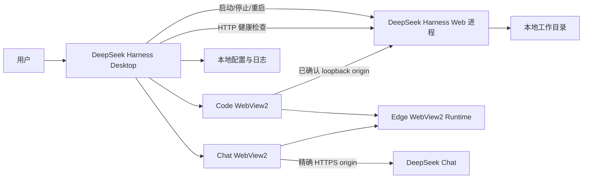
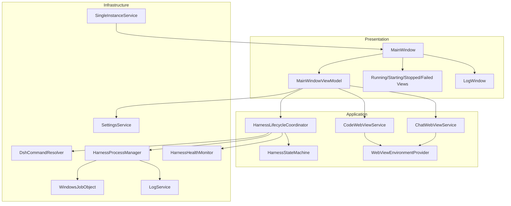
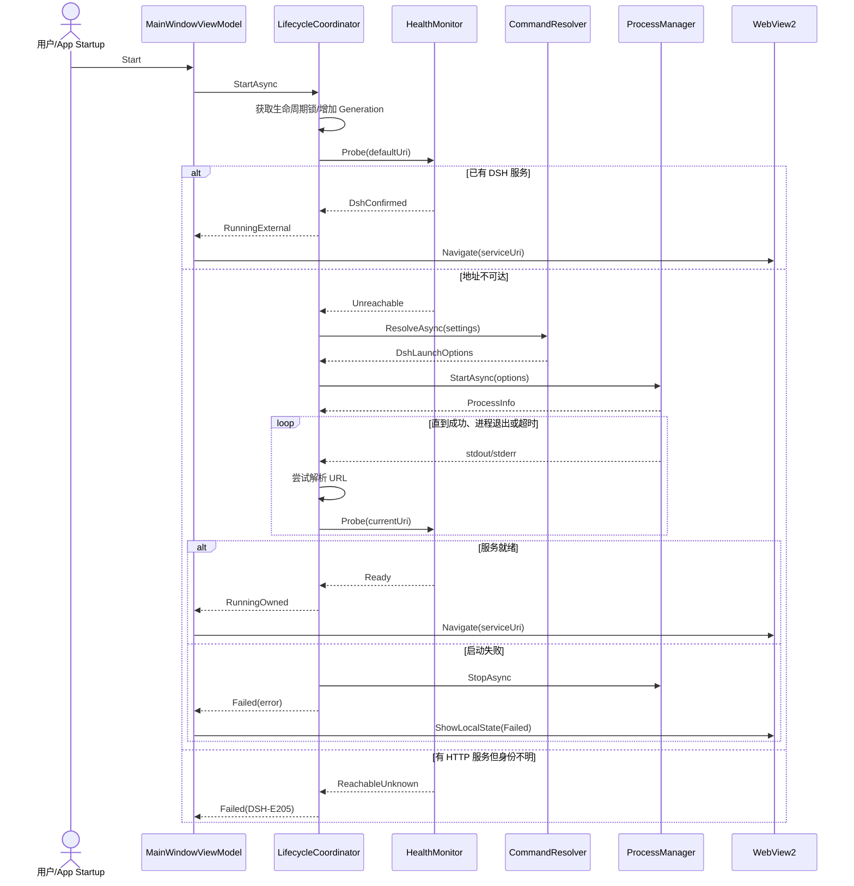
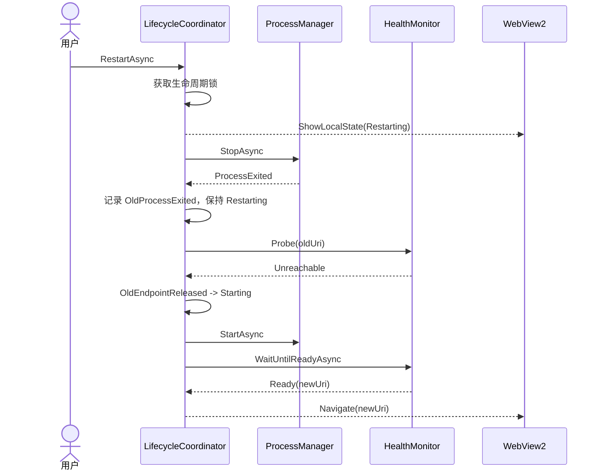

# DeepSeek Harness Desktop 详细设计方案

## 1. 文档信息

| 项目 | 内容 |
|---|---|
| 文档版本 | 1.6 |
| 更新日期 | 2026-08-19 |
| 目标版本 | Desktop 0.10.1 |
| 目标平台 | Windows 10/11 x64 |
| 桌面框架 | .NET Framework 4.8 / WPF |
| 网页宿主 | Microsoft Edge WebView2 |
| 默认 DSH 入口 | PATH `dsh.cmd`、Desktop 私有安装、校验后的固定 npx 缓存、确认后的一次锁定私有安装 |
| 默认服务地址 | `http://127.0.0.1:3080/` |

相关文档：

- [开发方案](./deepseek-harness-desktop-development.md)
- [开发计划](./deepseek-harness-desktop-development-plan.md)
- [交互原型](./deepseek-harness-desktop-prototype.html)
- [DeepSeek Harness 官方 Quick Start](https://deepseek-harness.github.io/deepseek-harness/guide/quickstart)

## 2. 设计目标

本应用是 DeepSeek Harness Web UI 的 Windows 桌面宿主，职责限定为：

1. 选择和保存 DSH 启动工作目录。
2. 启动本机 DSH Web 服务。
3. 检测服务是否就绪并取得实际访问地址。
4. 使用 WebView2 在应用窗口中加载 Web UI。
5. 管理由本应用创建的 DSH 进程，包括停止、重启和异常退出检测。
6. 提供启动日志、错误诊断、配置持久化和退出清理。
7. 在同一进程内切换 Code 与官方 Chat 页面，并保持两页实例和状态。
8. 使用独立 WebView2 profile 保存 Chat 官方会话，不复制、读取或导出凭据。

以下能力不在桌面宿主中重复实现：

- 模型和 API Key 配置
- 会话、消息和计划管理
- 工具调用和权限审批
- Harness 插件管理
- Web UI 内部工作区逻辑

## 3. 核心设计决策

| 编号 | 决策 | 原因 |
|---|---|---|
| DD-001 | 使用 WPF 和 .NET Framework 4.8 | Windows 10/11 原生兼容、无需额外部署 CoreCLR Desktop Runtime |
| DD-002 | 使用 WebView2 Evergreen Runtime | 与目标 Windows 环境匹配，不重复打包浏览器内核 |
| DD-003 | DSH 作为独立子进程运行 | 保持官方运行方式，隔离崩溃和升级影响 |
| DD-004 | 生命周期操作严格串行 | 防止同时启动、停止或重启造成双实例和端口竞争 |
| DD-005 | 只控制本应用创建的进程 | 避免误杀用户或其他应用启动的服务 |
| DD-006 | 先探测服务，再决定是否启动 | 已有实例可直接连接，减少端口冲突 |
| DD-007 | URL 优先从 DSH 输出解析 | DSH 可能改变端口，不能只依赖 `3080` |
| DD-008 | 配置使用版本化 JSON | 易读、可迁移、无需引入数据库 |
| DD-009 | UI 与进程服务通过接口解耦 | 便于测试状态机和异常路径 |
| DD-010 | Auto 依次复用全局 DSH、Desktop 私有安装和严格校验的固定 npx 缓存；全部缺失时才确认一次锁定私有安装 | 已安装环境不重复下载，同时冻结完整传递依赖图并拒绝任意 npm 参数 |
| DD-011 | Owned DSH 固定随桌面宿主退出 | 与 Job Object 的 `KILL_ON_JOB_CLOSE` 语义一致，优先保证无残留进程 |
| DD-012 | HTTP 可达与 DSH 身份确认分离 | 防止把占用端口的无关 Web 服务误判为外部 DSH |
| DD-013 | `RunningExternal` 使用主动健康监测 | 消除仅靠导航失败才能发现外部服务失联的状态盲区 |
| DD-014 | Code/Chat 是展示模式，不是 Harness 状态 | 切换模式不得改变 DSH PID、ownership、generation 或操作 CTS |
| DD-015 | 两个 WebView2 共享 environment、隔离 profile | 复用 Runtime 资源，同时避免 Code 与 Chat 浏览数据互相污染 |
| DD-016 | Chat 只内嵌精确官方 origin | 防止通配符、相似域名、IDN、尾点和非默认端口绕过 |
| DD-017 | Chat 权限与下载默认拒绝 | 在真实官方流程证明必要且可控前保持最小宿主能力 |

## 4. 系统上下文



## 5. 逻辑架构



## 6. 解决方案结构

```text
DeepSeekCLI/
├── DeepSeekHarnessDesktop.sln
├── Directory.Build.props
├── Directory.Packages.props
├── docs/
│   ├── deepseek-harness-desktop-development.md
│   ├── deepseek-harness-desktop-detailed-design.md
│   └── deepseek-harness-desktop-prototype.html
├── src/
│   └── DeepSeekHarnessDesktop/
│       ├── DeepSeekHarnessDesktop.csproj
│       ├── App.xaml
│       ├── App.xaml.cs
│       ├── app.manifest
│       ├── Assets/
│       │   └── App.ico
│       ├── Models/
│       │   ├── AppSettings.cs
│       │   ├── DshLaunchOptions.cs
│       │   ├── HarnessError.cs
│       │   ├── HarnessProcessInfo.cs
│       │   ├── HarnessRuntimeState.cs
│       │   └── HarnessStateSnapshot.cs
│       ├── Services/
│       │   ├── Abstractions/
│       │   │   ├── IDshCommandResolver.cs
│       │   │   ├── IHarnessHealthMonitor.cs
│       │   │   ├── IHarnessLifecycleCoordinator.cs
│       │   │   ├── IHarnessProcessManager.cs
│       │   │   ├── ISettingsService.cs
│       │   │   ├── ICodeWebViewService.cs
│       │   │   ├── IChatWebViewService.cs
│       │   │   └── IWebViewEnvironmentProvider.cs
│       │   ├── DshCommandResolver.cs
│       │   ├── HarnessHealthMonitor.cs
│       │   ├── HarnessLifecycleCoordinator.cs
│       │   ├── HarnessProcessManager.cs
│       │   ├── HarnessStateMachine.cs
│       │   ├── SettingsService.cs
│       │   ├── SingleInstanceService.cs
│       │   ├── WebViewEnvironmentProvider.cs
│       │   ├── CodeWebViewService.cs
│       │   ├── ChatWebViewService.cs
│       │   └── WindowsJobObject.cs
│       ├── ViewModels/
│       │   ├── MainWindowViewModel.cs
│       │   └── LogWindowViewModel.cs
│       ├── Views/
│       │   ├── MainWindow.xaml
│       │   ├── LogWindow.xaml
│       │   └── States/
│       │       ├── FailedView.xaml
│       │       ├── StartingView.xaml
│       │       └── StoppedView.xaml
│       └── Utilities/
│           ├── AsyncLock.cs
│           ├── AtomicFile.cs
│           └── UrlParser.cs
└── tests/
    ├── DeepSeekHarnessDesktop.UnitTests/
    └── DeepSeekHarnessDesktop.IntegrationTests/
```

## 7. 依赖设计

### 7.1 NuGet 包

| 包 | 锁定版本 | 用途 | 约束 |
|---|---:|---|---|
| `Microsoft.Web.WebView2` | `1.0.3537.50` | 嵌入官方 Web UI | 使用 Evergreen Runtime |
| `CommunityToolkit.Mvvm` | `8.4.0` | Observable 属性和异步命令 | 仅用于 ViewModel 层 |
| `Microsoft.Extensions.DependencyInjection` | `8.0.1` | 服务注册和生命周期 | 在 `App.xaml.cs` 中建立容器 |
| `Microsoft.Extensions.Logging.Abstractions` | `8.0.3` | 统一日志接口 | 业务服务不依赖具体日志实现 |
| `Serilog.Extensions.Logging` | `8.0.0` | 日志桥接 | 输出到文件与调试控制台 |
| `Serilog.Sinks.File` | `6.0.0` | 滚动文件日志 | 每日滚动，保留 7 天 |

启用 NuGet Central Package Management，所有 `PackageVersion` 统一写入 `Directory.Packages.props`，项目文件只写 `PackageReference`，禁止浮动版本。版本升级必须单独提交并通过构建、单元测试和发布验证。

```xml
<Project>
  <PropertyGroup>
    <ManagePackageVersionsCentrally>true</ManagePackageVersionsCentrally>
  </PropertyGroup>
  <ItemGroup>
    <PackageVersion Include="Microsoft.Web.WebView2" Version="1.0.3537.50" />
    <PackageVersion Include="CommunityToolkit.Mvvm" Version="8.4.0" />
    <PackageVersion Include="Microsoft.Extensions.DependencyInjection" Version="8.0.1" />
    <PackageVersion Include="Microsoft.Extensions.Logging.Abstractions" Version="8.0.3" />
    <PackageVersion Include="Serilog.Extensions.Logging" Version="8.0.0" />
    <PackageVersion Include="Serilog.Sinks.File" Version="6.0.0" />
  </ItemGroup>
</Project>
```

### 7.2 运行时依赖

- .NET Framework 4.8；Windows 11 和已更新的 Windows 10 通常已包含，应用启动前必须存在。
- Microsoft Edge WebView2 Evergreen Runtime。
- Auto 模式需要 PATH 中可用的全局 `dsh.cmd`，或 Node.js LTS 提供的 `node.exe` 与 `npx.cmd`。

发布包不携带 .NET、Node 或 DSH。缺少 WebView2/Node 时只打开官方安装页面；npx 下载固定版本 DSH 前必须由用户确认。

## 8. 领域模型

### 8.1 运行状态

```csharp
public enum HarnessRuntimeState
{
    Initializing,
    Stopped,
    Starting,
    RunningOwned,
    RunningExternal,
    Stopping,
    Restarting,
    Failed
}
```

状态语义：

| 状态 | 含义 | 可用操作 |
|---|---|---|
| `Initializing` | 加载配置并初始化 WebView2 | 无 |
| `Stopped` | 没有可访问服务 | 启动、选择目录 |
| `Starting` | 正在创建 DSH 并等待服务 | 停止、查看日志 |
| `RunningOwned` | 当前应用拥有 DSH 进程 | 刷新、停止、重启 |
| `RunningExternal` | 地址已确认是 DSH，但进程不归本应用所有 | 刷新 |
| `Stopping` | 正在结束应用实例 | 查看日志 |
| `Restarting` | 停止后准备重新启动 | 查看日志 |
| `Failed` | 启动、运行或导航失败 | 重试、查看日志、选择目录 |

### 8.2 状态快照

```csharp
public sealed record HarnessStateSnapshot(
    HarnessRuntimeState State,
    Uri? ServiceUri,
    int? ProcessId,
    bool IsOwned,
    HarnessError? Error,
    string StatusMessage,
    DateTimeOffset ChangedAt,
    long Generation);
```

`Generation` 是生命周期代次号。每次启动、停止或重启都会递增；异步回调必须比较代次号，旧操作的探测结果不得更新新状态。

### 8.3 启动选项

```csharp
public sealed record DshLaunchOptions
{
    public required string ExecutablePath { get; init; }
    public required IReadOnlyList<string> Arguments { get; init; }
    public required string WorkingDirectory { get; init; }
    public required Uri FallbackUri { get; init; }
    public TimeSpan StartupTimeout { get; init; } = TimeSpan.FromSeconds(60);
    public IReadOnlyDictionary<string, string> Environment { get; init; }
        = new Dictionary<string, string>();
}
```

### 8.4 进程信息

```csharp
public sealed record HarnessProcessInfo(
    int ProcessId,
    DateTimeOffset StartedAt,
    string WorkingDirectory,
    Uri? ReportedUri);
```

## 9. 服务接口

### 9.1 命令解析

```csharp
public interface IDshCommandResolver
{
    Task<DshLaunchOptions> ResolveAsync(AppSettings settings, CancellationToken cancellationToken);
}
```

解析顺序：

1. `Custom` 校验并使用用户配置的原生 `.exe`/`.com`。
2. Auto 优先查找 PATH 中的 `dsh.cmd`，生成固定 `web [--port <数字>]` 参数。
3. 未找到全局 DSH 时查找 `npx.cmd`，生成固定 `-y @deepseek-ai/dsh@0.1.0-rc.6 web [--port <数字>]` 参数。

Auto 不扫描 npm `_npx` 缓存，不接受用户包名或 Shell 参数；`.cmd` 只通过受控的 `CmdCommandLineBuilder` 执行。

### 9.2 进程管理

```csharp
public interface IHarnessProcessManager : IAsyncDisposable
{
    event EventHandler<ProcessOutputEventArgs>? OutputReceived;
    event EventHandler<ProcessExitedEventArgs>? ProcessExited;

    HarnessProcessInfo? Current { get; }
    bool IsRunning { get; }

    Task<HarnessProcessInfo> StartAsync(
        DshLaunchOptions options,
        CancellationToken cancellationToken);

    Task StopAsync(CancellationToken cancellationToken);
}
```

### 9.3 健康检查

```csharp
public interface IHarnessHealthMonitor
{
    Task<HealthProbeResult> ProbeAsync(
        Uri uri,
        TimeSpan timeout,
        CancellationToken cancellationToken);

    Task<HealthProbeResult> WaitUntilReadyAsync(
        Func<Uri> uriProvider,
        TimeSpan startupTimeout,
        CancellationToken cancellationToken);
}
```

`HealthProbeResult` 必须区分以下结果，不得用一个 `IsSuccess` 布尔值合并：

| 结果 | 含义 | 生命周期处理 |
|---|---|---|
| `DshConfirmed` | loopback HTTP 服务通过 DSH 身份校验 | 可进入 Owned/External Running 状态 |
| `Unreachable` | 连接拒绝、超时或无 HTTP 响应 | 启动前可继续创建 DSH；运行中计入失联次数 |
| `ReachableUnknown` | 收到 HTTP 响应，但不是可确认的 DSH 页面 | 返回 `DSH-E205`，不得导航或创建进程争抢端口 |
| `ExternalRedirect` | 重定向目标不是 loopback | 返回 `DSH-E204` |
| `InvalidUri` | URI 不满足语法或安全约束 | 返回 `DSH-E202` |

### 9.4 生命周期协调

```csharp
public interface IHarnessLifecycleCoordinator : IAsyncDisposable
{
    HarnessStateSnapshot Current { get; }
    event EventHandler<HarnessStateSnapshot>? StateChanged;

    Task InitializeAsync(CancellationToken cancellationToken);
    Task StartAsync(CancellationToken cancellationToken);
    Task StopAsync(CancellationToken cancellationToken);
    Task RestartAsync(CancellationToken cancellationToken);
}
```

### 9.5 WebView 页面服务

```csharp
public interface ICodeWebViewService
{
    Task InitializeAsync(CancellationToken cancellationToken);
    Task NavigateAsync(Uri uri, CancellationToken cancellationToken);
    Task ReloadAsync(CancellationToken cancellationToken);
    Task ShowLocalStateAsync(
        HarnessRuntimeState state,
        HarnessError? error,
        CancellationToken cancellationToken);
}

public interface IChatWebViewService
{
    ChatPageSnapshot Current { get; }
    event EventHandler<ChatPageSnapshot>? StateChanged;
    Task InitializeAsync(CancellationToken cancellationToken);
    Task ReloadAsync(CancellationToken cancellationToken);
    Task ClearBrowsingDataAsync(CancellationToken cancellationToken);
}
```

## 10. 线程与并发模型

### 10.1 基本规则

- WPF UI 和 WebView2 API 只在 Dispatcher 线程调用。
- 进程输出、HTTP 探测和文件 I/O 均异步执行。
- 生命周期操作由一个 `SemaphoreSlim(1, 1)` 串行化。
- 当前生命周期操作拥有独立 `CancellationTokenSource`。
- 运行期健康监测拥有与当前 `Generation` 绑定的独立 `CancellationTokenSource`。
- 新操作开始前取消旧操作，并递增 `Generation`。
- 进程输出事件不得直接修改 UI，只能进入协调器或 Dispatcher。
- 日志窗口最多保留最近 1,000 行，防止长时间运行导致内存增长。

### 10.2 生命周期锁

```csharp
private readonly SemaphoreSlim _lifecycleGate = new(1, 1);
private CancellationTokenSource? _operationCts;
private long _generation;
```

每个公开生命周期方法遵循：

1. 等待 `_lifecycleGate`。
2. 取消并释放旧 `_operationCts`。
3. 创建链接 CancellationToken。
4. 增加 `_generation` 并保存当前值。
5. 执行状态转换。
6. 每次异步返回后校验 generation。
7. 在 `finally` 中释放锁。

运行期探测不在持有 `_lifecycleGate` 时等待网络 I/O：先读取当前快照和 generation，完成探测后再获取锁；只有 generation 未变化且状态仍匹配时才能提交结果。状态离开 Running 或应用退出时立即取消并释放监测 CTS。

## 11. 启动命令设计

### 11.1 Auto 入口

Auto 优先使用 PATH 中的 `dsh.cmd`；未找到时使用 PATH 中的 `npx.cmd`。包规格固定为 `@deepseek-ai/dsh@0.1.0-rc.6`，其余参数仅允许 `-y`、`web` 和可选数字端口。工作目录只写入 `WorkingDirectory`，不拼入命令行。

### 11.2 创建期进程归属

Owned 原生进程使用 `CreateProcessW(CREATE_SUSPENDED)` 创建并建立匿名 stdout/stderr 管道。在任何用户代码执行前，将进程句柄加入带 `KILL_ON_JOB_CLOSE` 的 Job Object，完成跟踪和事件注册后再 `ResumeThread`。任一步失败都关闭线程、进程、管道和 Job 句柄；不得回退到存在 `Process.Start` 后分配 Job 窗口的实现。

Custom 仍只接受 `.exe`/`.com` 并使用结构化参数；`.cmd`/`.bat` 和任意 Shell 文本不属于支持面。

### 11.3 环境变量

默认继承当前用户环境。应用只增加自身需要的标识：

```text
DSH_DESKTOP_HOST=1
DSH_DESKTOP_VERSION=<app-version>
```

除非 DSH 官方文档明确支持，否则不注入 API Key 或模型配置。

## 12. 启动流程详细设计



### 12.1 初始化启动

应用启动时：

1. 获取单实例锁。
2. 加载配置。
3. 创建主窗口。
4. 初始化 WebView2 Environment。
5. 订阅进程和 WebView2 事件。
6. 调用 `InitializeAsync`。
7. 探测配置中的服务地址。
8. 若返回 `DshConfirmed`，进入 `RunningExternal` 并启动运行期监测。
9. 若返回 `ReachableUnknown`，进入 `Failed(DSH-E205)`，不启动新进程。
10. 若返回 `ExternalRedirect` 或 `InvalidUri`，分别进入 `Failed(DSH-E204/DSH-E202)`。
11. 若返回 `Unreachable` 且 `AutoStart=true`，调用 `StartAsync`。
12. 否则进入 `Stopped`。

### 12.2 URL 解析

从 stdout 和 stderr 中识别本机 HTTP URL：

```regex
https?://(?:127\.0\.0\.1|localhost|\[::1\])(?::\d{1,5})?/?[^\s]*
```

处理规则：

1. 对每一行先剥离完整 ANSI CSI/OSC 控制序列，再执行正则匹配。
2. 去除 URL 结尾的句号、逗号、分号和不配对的右括号。
3. 只接受 `http` 或 `https`。
4. 默认只接受 loopback host。
5. 正则以 `\d{1,5}` 做词法筛选，随后必须以数值校验端口 1-65535；二者职责不同。
6. 解析成功后更新候选 URI，但必须通过健康检查和 DSH 身份确认才可导航。
7. 未解析到地址时继续探测配置中的 fallback URI。

### 12.3 健康检查

使用单例 `HttpClient`，但每次探测通过 CancellationToken 控制超时。

| 参数 | 默认值 |
|---|---|
| 单次请求超时 | 2 秒 |
| 首次探测间隔 | 300 毫秒 |
| 后续探测间隔 | 500 毫秒 |
| 总启动超时 | 300 秒 |
| 请求方法 | `GET /` |
| 最大响应读取 | 256 KiB |
| 最大重定向次数 | 5 次 |
| DSH 成功条件 | 最终响应为 2xx、`Content-Type` 为 HTML，且通过身份特征校验 |

关闭 `HttpClientHandler.AllowAutoRedirect`，由 `HarnessHealthMonitor` 逐跳处理重定向：

1. 相对地址按当前 URI 解析。
2. 允许 loopback 到 loopback 的重定向，包括 `127.0.0.1`、`localhost`、`[::1]` 之间以及端口变化。
3. 任一跳转向非 loopback、非 HTTP(S) 或含用户信息的地址，立即返回 `ExternalRedirect`/`DSH-E204`。
4. 超过 5 跳、循环重定向或非法 `Location` 返回 `InvalidUri`/`DSH-E202`。
5. 最终 URI 作为已验证 Service URI，后续导航和同源规则使用该 URI。

DSH 身份校验不以普通 2xx/4xx 为依据。最终 HTML 必须同时包含大小写精确的 `<title>DeepSeek Harness</title>` 和运行时注入标记 `window.__DSH_BOOT__`；固定版本 npx 路径同样不得放宽身份检查。收到 HTTP 响应但特征不匹配时返回 `ReachableUnknown`，启动前映射为 `DSH-E205`。

`HttpClient` 为单例；每次探测创建并在 `finally`/`using` 中释放 linked `CancellationTokenSource`。该 CTS 不跨探测复用，避免取消状态泄漏；以 5 秒量级的轮询频率不会造成有意义的资源压力。

### 12.4 启动超时

达到启动超时后：

1. 取消健康检查。
2. 停止当前应用创建的 DSH 进程树。
3. 状态进入 `Failed`。
4. 错误码为 `DSH-E203`。
5. 保留启动日志用于诊断。
6. UI 提供“重试启动”和“查看日志”。

## 13. 进程管理详细设计

### 13.1 启动

`HarnessProcessManager.StartAsync` 必须保证：

- 已有应用进程运行时拒绝再次启动。
- `WorkingDirectory` 必须存在。
- 进程启动后立即记录 PID 和启动时间。
- 同时启动 stdout 和 stderr 的异步逐行读取。
- 注册 `Exited` 事件并启用 `EnableRaisingEvents`。
- 将进程加入 Windows Job Object。
- 输出事件包含来源、时间和文本。

### 13.2 输出处理

```csharp
public sealed record ProcessOutputLine(
    DateTimeOffset Timestamp,
    ProcessOutputSource Source,
    string Text);
```

处理流水线：

1. 去除空行和 ANSI 控制序列。
2. 写入滚动文件日志。
3. 推送到 UI 有界日志集合。
4. 交给 URL Parser 检查服务地址。

单行最大保存 16 KB，超过部分截断并添加标记。不得在日志层解析或记录 WebView2 Cookie、Authorization Header 或 API Key。

### 13.3 停止

当前 DSH 文档没有公开的关闭 API，MVP 停止策略为：

1. 取消当前健康检查和导航。
2. 将状态切换为 `Stopping`。
3. 关闭当前 Owned 进程对应的 Job Object，使用 `KILL_ON_JOB_CLOSE` 终止整个进程树。
4. 通过 net48 兼容的异步退出等待，默认不超过 5 秒。
5. 超时后再次确认 Job 已关闭，并在有限门限内等待退出完成。
6. 释放 stdout/stderr 读取任务和 `Process` 对象。
7. 清空进程所有权信息。
8. 状态切换为 `Stopped`。

未来若 DSH 提供正式 shutdown API，应优先调用 API，再以进程树终止作为超时兜底。

### 13.4 Windows Job Object

`WindowsJobObject` 使用 P/Invoke 创建 Job，并配置：

```text
JOB_OBJECT_LIMIT_KILL_ON_JOB_CLOSE
```

用途：

- 应用正常退出时清理 DSH 及其子进程。
- 应用异常退出时由 Windows 关闭 Job Handle 并清理子进程。
- 防止 cmd -> node 多层进程残留。

MVP 明确选择“桌面宿主退出即停止 Owned DSH”：所有 Owned 进程都加入带 `KILL_ON_JOB_CLOSE` 的 Job，不提供“退出后保留 Owned DSH”配置。该选择牺牲后台保留能力，以满足崩溃清理和“应用退出后无残留进程”的验收要求；未来若增加托盘常驻，应由宿主继续持有 Job Handle，而不是让进程脱离 Job。

若 `AssignProcessToJobObject` 失败，启动必须失败并清理尚未恢复的挂起进程；不得让 Owned 进程脱离 Job 后继续运行。

### 13.5 外部实例

如果启动前目标 URL 返回 `DshConfirmed`：

- 标记为 `RunningExternal`。
- 不保存 PID。
- 不创建 Job Object。
- 禁用停止和重启按钮。
- 允许刷新 WebView2。
- 页面不可访问后切换为 `Stopped`，但不主动启动，除非用户点击启动。

如果地址返回 `ReachableUnknown`，不得标记为 `RunningExternal`，而应进入 `Failed(DSH-E205)`。UI 显示“检测到已有服务，但无法确认它是 DeepSeek Harness”，提供目标地址、重新探测和修改地址操作。无论身份是否确认，只要进程不属于本应用，就不得尝试结束它。

### 13.6 运行期健康监测

进入 `RunningExternal` 后立即启动主动监测，不能仅依赖 WebView2 导航失败：

- 使用可取消的 `Task.Delay` 串行循环，默认每 5 秒探测当前已验证 Service URI，单次超时 2 秒。
- 同一时刻最多一个探测；慢探测不会并发堆积。
- 连续 3 次 `Unreachable` 才发布 `HealthLost`，避免一次瞬时抖动改变状态；任一次成功清零计数。
- `ReachableUnknown` 表示端口上的服务身份发生变化，立即发布 `HealthLost`，状态文字明确“原 DSH 已不可用，地址上检测到其他服务”。
- `ExternalRedirect` 或 `InvalidUri` 同样立即发布 `HealthLost` 并记录对应错误码，不跟随到外部地址。
- 探测任务携带进入 Running 状态时的 generation。网络请求期间不持有生命周期锁；提交结果前重新获取锁并校验 generation 与当前状态。
- 离开 `RunningExternal`、应用退出或用户发起新的生命周期操作时取消监测 CTS，并等待监测任务结束。
- `HealthLost` 后进入 `Stopped`，不自动启动或接管任何进程；用户手动点击“启动”时重新执行完整的启动前身份探测。

## 14. 重启流程



约束：

- `RunningExternal` 不允许重启。
- `OldProcessExited` 只记录“旧进程已退出”，状态仍保持 `Restarting`；只有随后收到 `OldEndpointReleased` 才能进入 `Starting`。
- 必须确认旧进程退出且旧 URI 连续 2 次 `Unreachable` 后再启动，两次探测间隔 300 毫秒，总等待不超过 5 秒。
- 若旧 URI 返回 `DshConfirmed` 或 `ReachableUnknown`，说明地址仍被占用，重启进入 `Failed(DSH-E205)`，不得创建新进程。
- 重启复用当前工作目录和启动配置。
- 新进程可以报告不同 URI，WebView2 应导航到新 URI。
- 重启失败进入 `Failed`，不得自动无限重试。

## 15. 状态机设计

### 15.1 合法转换

| 当前状态 | 事件 | 下一状态 |
|---|---|---|
| `Initializing` | DshConfirmed | `RunningExternal` |
| `Initializing` | ReachableUnknown | `Failed` (`DSH-E205`) |
| `Initializing` | ExternalRedirect/InvalidUri | `Failed` (`DSH-E204/DSH-E202`) |
| `Initializing` | 配置完成且需自动启动 | `Starting` |
| `Initializing` | 配置完成且不自动启动 | `Stopped` |
| `Stopped` | Start | `Starting` |
| `Starting` | PreflightDshConfirmed | `RunningExternal` |
| `Starting` | PreflightReachableUnknown | `Failed` (`DSH-E205`) |
| `Starting` | PreflightExternalRedirect/InvalidUri | `Failed` (`DSH-E204/DSH-E202`) |
| `Starting` | PreflightUnreachable | `Starting`（允许创建 Owned 进程） |
| `Starting` | ProcessStarted | `Starting`（npx 自动准备或等待 DSH 服务就绪） |
| `Starting` | HealthReady | `RunningOwned` |
| `Starting` | Cancel/Stop | `Stopping` |
| `Starting` | ProcessExited/Timeout/Error | `Failed` |
| `RunningOwned` | Stop | `Stopping` |
| `RunningOwned` | Restart | `Restarting` |
| `RunningOwned` | ProcessExited | `Failed` |
| `RunningExternal` | HealthLost | `Stopped` |
| `Stopping` | ProcessExited | `Stopped` |
| `Restarting` | OldProcessExited | `Restarting`（记录守卫事实） |
| `Restarting` | OldEndpointReleased | `Starting` |
| `Restarting` | Error | `Failed` |
| `Failed` | Retry | `Starting`（重新执行完整 preflight，不直接创建进程） |
| `Failed` | Dismiss | `Stopped` |

非法转换写入 Debug 日志并返回，不抛出导致应用崩溃的异常。

### 15.2 状态更新规则

- 状态只能由 `HarnessLifecycleCoordinator` 修改。
- ViewModel 不直接写状态。
- 每次状态变化发布完整不可变快照。
- UI 订阅事件后通过 Dispatcher 更新属性。
- 所有按钮的 `CanExecute` 由状态快照计算。

## 16. ViewModel 设计

### 16.1 MainWindowViewModel

主要属性：

```csharp
public HarnessRuntimeState State { get; }
public string WorkspacePath { get; set; }
public string StatusTitle { get; }
public string StatusDetail { get; }
public Uri? ServiceUri { get; }
public bool IsWebViewVisible { get; }
public bool IsStateViewVisible { get; }
public bool CanChangeWorkspace { get; }
public ObservableCollection<ProcessOutputLine> RecentLogs { get; }
```

命令：

```csharp
public IAsyncRelayCommand StartCommand { get; }
public IAsyncRelayCommand StopCommand { get; }
public IAsyncRelayCommand RestartCommand { get; }
public IAsyncRelayCommand ReloadPageCommand { get; }
public IAsyncRelayCommand SelectWorkspaceCommand { get; }
public IRelayCommand OpenLogsCommand { get; }
public IRelayCommand OpenSettingsCommand { get; }
```

### 16.2 命令可用性

| 命令 | 可用状态 |
|---|---|
| Start | `Stopped`, `Failed` |
| Stop | `Starting`, `RunningOwned` |
| Restart | `RunningOwned` |
| ReloadPage | `RunningOwned`, `RunningExternal` |
| SelectWorkspace | `Stopped`, `Failed` |
| OpenLogs | 全部状态 |

运行中选择新工作目录时，UI 必须先确认是否重启。首版也可简化为运行中禁用选择目录。

## 17. WPF 界面详细设计

### 17.1 MainWindow 布局

```text
Grid
├── Row 0: DesktopCommandBar (Auto)
│   ├── WorkspacePicker
│   ├── RuntimeStatus
│   └── LifecycleButtons
├── Row 1: ContentHost (*)
│   ├── WebView2
│   ├── StartingView
│   ├── StoppedView
│   └── FailedView
└── Row 2: StatusBar (Auto)
```

使用标准 Windows 标题栏作为 MVP 默认方案。交互原型中的自绘标题栏只表示视觉方向，首版不为视觉效果承担窗口拖动、缩放和高 DPI 命中测试风险。

### 17.2 控件规格

| 控件 | 最小尺寸 | 行为 |
|---|---:|---|
| 命令栏 | 高 52 px | 不随 Web 页面滚动 |
| 工作目录输入区 | 宽 260 px | 超长路径中间或尾部省略，悬停显示全路径 |
| 普通按钮 | 高 32 px | 使用系统焦点和键盘导航 |
| 图标按钮 | 32 x 32 px | 必须有 AutomationProperties.Name |
| 状态栏 | 高 24 px | 显示所有权、URL 和版本 |
| 内容区域 | 最小 640 x 420 px | WebView2 填满剩余区域 |

### 17.3 窗口规则

- 默认尺寸：1280 x 820。
- 最小尺寸：820 x 600。
- 保存窗口位置、尺寸和最大化状态。
- 恢复位置必须落在当前可见屏幕范围内。
- 支持 Per-Monitor V2 DPI。
- 点击关闭按钮默认隐藏到系统托盘；双击托盘图标或选择“打开”恢复窗口。
- 只有托盘“退出”或系统注销/关机触发真实退出和 Owned DSH 清理。

### 17.4 键盘与可访问性

- `F5`：刷新 WebView2。
- `Ctrl+Alt+R`：重启 DSH，执行前确认，避免占用浏览器惯用的硬刷新组合键。
- `Ctrl+Alt+L`：打开日志窗口。
- `F6`：在桌面控制栏与 WebView2 之间切换焦点。
- `Esc`：关闭当前对话框或日志窗口。
- 所有图标按钮提供可访问名称和 Tooltip。
- 状态变化通过 Automation LiveRegion 通知。

快捷键统一进入 `DesktopShortcutRouter`。主窗口通过 `PreviewKeyDown` 处理 WPF 焦点；锁定版本的 WPF WebView2 控件在内部订阅 `CoreWebView2Controller.AcceleratorKeyPressed`，并将 WebView2 HWND 收到的加速键转发为控件的标准 WPF `PreviewKeyDown`，因此在 WebView2 控件上订阅 `PreviewKeyDown` 并转发同一套路由。命中宿主快捷键时标记已处理。不得只依赖窗口级 `InputBinding`，因为 WebView2 拥有独立 HWND 和键盘处理链。

## 18. WebView2 详细设计

### 18.1 初始化

用户数据目录：

```text
%LOCALAPPDATA%\DeepSeekHarnessDesktop\WebView2
```

`WebViewEnvironmentProvider` 在固定数据根目录并发幂等地创建一个 `CoreWebView2Environment`。Code 使用原有默认 profile；Chat 使用 controller options 固定 `ProfileName=Chat`、`IsInPrivateModeEnabled=false`。应用冷启动只初始化 Code，第一次切换到 Chat 才创建 Chat controller 和访问网络。

两个 WPF 控件始终留在主窗口中，以 `Collapsed/Visible` 切换。普通模式切换不 Dispose、不 Reload；真正退出时服务取消操作、解除全部 CoreWebView2 事件并释放各自控件。加载或错误状态先折叠 WebView2，再显示同一区域的原生状态页，规避 HWND airspace 覆盖。

### 18.2 WebView2 设置

```text
AreDefaultContextMenusEnabled = true
AreDevToolsEnabled = false (Release)
IsStatusBarEnabled = false
IsZoomControlEnabled = true
AreBrowserAcceleratorKeysEnabled = false
```

Code 的 Debug 构建允许通过设置开启开发者工具，Release 关闭；Chat 在所有构建中关闭 DevTools。Chat profile 请求启用 `IsPasswordAutosaveEnabled` 与 `IsGeneralAutofillEnabled`，但原生密码提示是否出现取决于 Runtime、Windows 和企业策略，宿主不提供凭据模型或绕过机制。

### 18.3 导航策略

Code 允许当前已验证的 DSH Service URI 同源地址。健康检查完成 loopback 内部重定向后，只信任最终已验证 URI 的 origin；其他 loopback host 或端口必须重新通过身份检查。

Chat 允许精确 `https://chat.deepseek.com:443`。每次顶层导航和重定向重新执行 `ChatNavigationPolicy`，比较绝对 URI 的 scheme、ASCII/IDN host、有效端口与 UserInfo；拒绝 HTTP 版 Chat、非默认端口、尾点、用户信息、IDN 混淆和危险协议。其他合法 HTTP(S) 链接外开。额外登录/验证码 origin 未经真实验证不得加入，禁止 wildcard。

处理规则：

- Code/Chat 分别订阅 `NavigationStarting`，不共享可变允许列表。
- Chat 对宿主主动取消的 navigation id 做标记，后续 `NavigationCompleted` 不误报网络失败。
- `NewWindowRequested` 始终设置 `Handled=true`；仅精确 Chat origin 可在当前 Chat 控件导航，其他安全 HTTP(S) 外开。
- `file:`、`data:`、`javascript:` 默认拒绝。
- `PermissionRequested` 默认 `Deny`，`DownloadStarting` 默认 `Cancel=true`。
- 不向网页注入宿主对象。
- 不调用 `AddHostObjectToScript`。
- 不执行来自 DSH 页面的任意宿主命令。

### 18.4 页面错误

| WebView2 事件 | 处理 |
|---|---|
| `NavigationCompleted.IsSuccess=false` | 重新探测 DSH；不可达则显示连接失败状态 |
| `ProcessFailed` | 记录原因并重建 WebView2；最多自动重建 1 次 |
| Runtime 缺失 | 显示 `WEB-E301` 和安装说明 |
| 外部链接 | 系统默认浏览器打开 |

Chat 不调用生命周期协调器，使用独立快照和错误号段：`WEB-E311` 初始化/profile、`WEB-E312` 网络/DNS、`WEB-E313` TLS、`WEB-E314` HTTP、`WEB-E315` 页面进程、`WEB-E316` profile 清除、`WEB-E318` 外链启动。宿主主动取消不映射为错误。单页只自动恢复一次，显式重试只导航固定入口。

页面导航失败不直接重启 DSH。必须先通过健康检查区分网页渲染故障和服务故障。

### 18.5 页面刷新

`ReloadPageCommand` 按当前模式路由：Code 调用 Reload；Chat 重新导航固定入口。两者均满足：

- 不修改 Harness 状态。
- 不停止或重启进程。
- 不清除 WebView2 用户数据。
- 若服务已经不可达，刷新失败后进入连接失败处理。

### 18.6 Chat 数据清除

清除命令仅在 Chat profile 已初始化后可用：用户二次确认后，Chat 服务持有单页操作门，停止当前导航，调用 `ClearBrowsingDataAsync(AllProfile)`，成功后重新导航固定入口。失败映射 `WEB-E316`，不得直接删除 profile 目录，也不得影响 Code profile、工作目录、设置、日志或 DSH。

### 18.7 模式与并发

`MainWindowViewModel` 默认 `AppContentMode.Code`，不写入 `AppSettings`。首次 Chat 初始化用进程内标记去重；Chat 服务另有 `SemaphoreSlim`、lifetime CTS 与 generation，过期快照不得覆盖较新状态。隐藏到托盘、第二实例激活、最小化和恢复只操作窗口，不重置模式或释放 controller；完整退出再统一释放。

## 19. 配置详细设计

### 19.1 文件位置

```text
%APPDATA%\DeepSeekHarnessDesktop\settings.json
```

### 19.2 JSON Schema

```json
{
  "schemaVersion": 2,
  "workspacePath": "E:\\DeepSeekCLI",
  "serviceUri": "http://127.0.0.1:3080/",
  "autoStart": true,
  "startupTimeoutSeconds": 300,
  "launch": {
    "mode": "Auto",
    "executablePath": null,
    "arguments": []
  },
  "window": {
    "left": null,
    "top": null,
    "width": 1280,
    "height": 820,
    "isMaximized": false
  },
  "webView": {
    "zoomFactor": 1.0,
    "allowDevTools": false
  }
}
```

### 19.3 校验规则

- `schemaVersion` 必须为支持的正整数。
- `workspacePath` 必须是绝对路径。
- `serviceUri` 默认只允许 loopback HTTP/HTTPS。
- `startupTimeoutSeconds` 范围为 5-300。
- `window.width` 不小于 820，`window.height` 不小于 600。
- `zoomFactor` 范围为 0.5-2.0。
- `launch.mode` 只允许 `Auto` 或 `Custom`。

### 19.4 原子保存

保存步骤：

1. 将新配置写入 `settings.json.tmp`。
2. Flush 文件内容。
3. 若原文件存在，替换并保留单份 `.bak`。
4. 若替换失败，不删除原文件。
5. 应用启动发现主文件损坏时尝试读取 `.bak`。
6. 两者都失败则使用默认配置并记录 `CFG-E401`。

### 19.5 迁移

`SettingsService` 使用“读取 JSON → 按 schema 迁移 → 反序列化 → 验证”的统一管线，主配置与 `.bak` 恢复路径完全复用。v1 无法区分历史默认 60 与用户显式设置 60，因此统一迁移为 300；其他 5-300 范围内的值保留。禁止跨版本直接覆盖未知字段；迁移失败时保留原始配置文件并使用默认值启动。

## 20. 日志详细设计

### 20.1 文件位置

```text
%LOCALAPPDATA%\DeepSeekHarnessDesktop\logs\desktop-.log
```

Serilog 配置：

- 每日滚动。
- 单文件最大 10 MB。
- 默认保留 7 天。
- 输出模板包含时间、级别、来源、事件 ID 和消息。
- Debug 构建额外输出到调试控制台。

### 20.2 事件分类

| Event ID | 分类 |
|---|---|
| 1000-1099 | 应用启动和退出 |
| 1100-1199 | 配置加载与保存 |
| 2000-2099 | DSH 命令解析 |
| 2100-2199 | 进程启动与退出 |
| 2200-2299 | 健康检查 |
| 2300-2399 | 状态转换 |
| 3000-3099 | WebView2 初始化与导航 |
| 4000-4099 | 用户操作 |
| 9000-9999 | 未处理异常 |

### 20.3 脱敏

写入日志前替换：

- `Authorization: Bearer ...`
- 名称包含 `API_KEY`、`TOKEN`、`SECRET` 的环境变量值
- URL Query 中的 `key`、`token`、`secret` 参数

工作目录属于诊断必要信息，可以记录；日志导出前 UI 应提示其中可能包含本地路径。

## 21. 错误模型

```csharp
public sealed record HarnessError(
    string Code,
    string UserMessage,
    string TechnicalMessage,
    bool IsRetryable,
    Exception? Exception = null);
```

### 21.1 错误码

| 错误码 | 用户提示 | 是否可重试 |
|---|---|---:|
| `DSH-E101` | 未找到全局 DSH，且 Node.js 或 npx 不可用 | 否 |
| `DSH-E102` | 工作目录不存在或不可访问 | 否 |
| `DSH-E103` | 无法创建 DSH 进程 | 是 |
| `DSH-E201` | DSH 进程意外退出 | 是 |
| `DSH-E202` | 服务地址无效 | 是（修改配置后） |
| `DSH-E203` | DSH 启动超时 | 是 |
| `DSH-E204` | 服务重定向到不允许的地址 | 否 |
| `DSH-E205` | 端口被其他服务占用 | 是（释放端口或修改地址后） |
| `DSH-E206` | 无法停止 DSH 进程树 | 是 |
| `DSH-E211` | 无法连接 npm registry，请检查 DNS 和网络 | 是 |
| `DSH-E212` | npm 安全连接失败，请检查系统时间、代理和证书 | 是 |
| `DSH-E213` | npm registry 拒绝或未找到 DSH 包 | 是 |
| `DSH-E214` | npm 缓存或目录权限不足 | 是 |
| `DSH-E215` | 旧 npx 停滞迁移诊断（预留） | 否 |
| `WEB-E301` | WebView2 Runtime 不可用 | 否 |
| `WEB-E302` | 页面加载失败 | 是 |
| `WEB-E303` | WebView2 渲染进程异常 | 是 |
| `WEB-E311` | DeepSeek Chat 初始化失败 | 是 |
| `WEB-E312` | 无法连接或解析 DeepSeek Chat | 是 |
| `WEB-E313` | DeepSeek Chat 安全连接失败 | 是 |
| `WEB-E314` | DeepSeek Chat 服务返回错误 | 是 |
| `WEB-E315` | DeepSeek Chat 页面进程异常 | 是 |
| `WEB-E316` | 无法清除 Chat 登录信息 | 是 |
| `WEB-E318` | 无法打开外部链接 | 是 |
| `CFG-E401` | 配置文件损坏，已恢复默认设置 | 否 |
| `CFG-E402` | 无法保存设置 | 是 |
| `APP-E501` | 应用已经在运行 | 否 |
| `APP-E599` | 应用发生未处理错误 | 是 |

UI 只显示 `UserMessage` 和错误码；完整异常写入日志。

## 22. 单实例设计

使用命名 Mutex：

```text
Local\DeepSeekHarnessDesktop-<CurrentUserSid>
```

第二个实例启动时：

1. 检测 Mutex 已存在。
2. 通过命名管道向首个实例发送 `Activate` 消息。
3. 首个实例恢复并激活主窗口。
4. 第二个实例立即退出。

命名管道只接受当前用户 SID，消息协议仅支持固定命令，不接受任意 Shell 内容。

## 23. 应用退出设计

### 23.0 托盘与窗口关闭

- 应用使用 `ShutdownMode=OnExplicitShutdown`，主窗口隐藏不结束 Dispatcher。
- 普通 `Closing` 事件取消关闭并隐藏窗口；Owned DSH、健康监测和 Job Handle 保持运行。
- 托盘菜单只提供“打开 DeepSeek Harness Desktop”和“退出”两个明确命令。
- 单实例 `Activate` 消息与托盘“打开”复用同一恢复逻辑。
- 显式退出设置不可逆退出标记，重复请求不得启动第二次清理。
- 系统会话结束不隐藏窗口，执行最佳努力清理并允许 Windows 结束进程。

### 23.1 退出场景

| 当前状态 | 默认行为 |
|---|---|
| `Stopped`, `Failed` | 直接退出 |
| `RunningExternal` | 直接退出，不操作外部服务 |
| `RunningOwned` | 停止 Owned DSH 后退出 |
| `Starting`, `Restarting` | 取消操作，停止已创建进程后退出 |
| `Stopping` | 等待停止完成后退出 |

### 23.2 退出超时

- 正常清理总超时：8 秒。
- 超时后关闭 Job Object。
- 不提供跳过 Owned DSH 清理的配置；Job Handle 的生命周期与桌面宿主一致。
- 保存窗口状态不阻塞进程清理。
- 未处理异常处理器仅做日志记录和最佳努力清理，不继续运行未知状态的应用。

## 24. 安全设计

### 24.1 进程安全

- 默认命令和参数由程序生成。
- 工作目录不参与 Shell 拼接。
- 自定义启动命令必须显式启用高级模式。
- 不使用管理员权限。
- 不结束非本应用拥有的进程。

### 24.2 WebView 安全

- 不启用宿主对象注入。
- 不向网页暴露启动、停止或文件系统接口。
- 限制内嵌导航来源。
- 外部链接在系统浏览器打开。
- Release 默认关闭 DevTools。
- 不读取或记录 Cookie、LocalStorage；API Key 仅通过 DSH 的本地凭据来源按需读取，不写入日志。

### 24.4 DeepSeek 账户查询

- 仅调用官方固定端点 `GET https://api.deepseek.com/user/balance`。
- 查询时按 DSH 的优先级自动解析 `DEEPSEEK_API_KEY`：启动进程环境、`$DSH_HOME/.credentials.yaml`、当前工作区 `.env`、`$DSH_HOME/.env`。`$DSH_HOME` 未设置时默认为 `~/.dsh`。
- `PasswordBox` 仍允许对单次查询手工覆盖；输入值仅保存在当前应用进程内存，不写入 `settings.json`、日志或异常文本。
- 不读取 WebView2 Cookie、LocalStorage 或 Authorization Header；凭据文件只读取 `DEEPSEEK_API_KEY`，不修改或删除任何 DSH 配置。
- 余额响应按 `is_available` 和 `balance_infos` 解析，金额使用 invariant culture 的十进制解析。
- 官方 API 参考没有账号资料或账户级历史 Token 统计端点；界面必须如实显示不可用状态。
- 官方文档所述 Token 用量以每次模型响应的 `usage` 为准；宿主未直接发起的 DSH 请求不做推算或本地冒充统计。

错误码：

| 错误码 | 用户提示 | 是否可重试 |
|---|---|---:|
| `API-E600` | 未找到 DeepSeek API Key，请先在 Harness 模型设置中配置 | 否 |
| `API-E601` | API Key 无效或无权访问账户信息 | 否 |
| `API-E602` | 请求过于频繁，请稍后重试 | 是 |
| `API-E603` | DeepSeek API 请求超时 | 是 |
| `API-E604` | DeepSeek API 暂时不可用 | 是 |
| `API-E605` | DeepSeek API 返回了无法识别的数据 | 是 |
| `API-E606` | 无法查询 DeepSeek 账户信息 | 是 |

### 24.3 文件安全

- 配置和日志仅写入当前用户目录。
- 不修改 DSH 自身配置。
- 清除 WebView2 数据属于破坏性操作，执行前必须确认。
- 日志导出由用户主动触发。

## 25. 测试设计

### 25.1 单元测试矩阵

| 测试对象 | 测试点 |
|---|---|
| `HarnessStateMachine` | 所有合法转换、非法转换、快照 generation |
| `DshCommandResolver` | 全局 DSH 优先、固定版本 npx 参数、端口约束、自定义原生 EXE |
| `DependencyDiagnosticsService` | WebView2、Node、npx、全局 DSH 发现和缺失组合 |
| `NpmFailureClassifier` | DNS、TLS、registry、权限错误稳定映射 |
| `UrlParser` | 先剥离 ANSI，再解析 IPv4、localhost、IPv6、非法端口和外部地址 |
| `SettingsService` | 默认值、原子保存、备份恢复、版本迁移、损坏 JSON |
| `HarnessHealthMonitor` | DSH 双特征身份确认、未知 HTTP 服务、超时、取消、loopback 内部重定向、外部重定向、CTS 释放 |
| `HarnessLifecycleCoordinator` | 启动、停止、重启、旧回调丢弃、并发命令 |
| `RuntimeHealthWatcher` | 5 秒周期、单探测串行、连续 3 次失联、恢复清零、generation 失效、退出取消 |
| `MainWindowViewModel` | 命令 CanExecute、状态文案、UI 可见性 |
| 日志脱敏 | Bearer Token、API Key、Query Secret |

### 25.2 集成测试替身

在测试项目中提供 `FakeHarnessServer`：

- 启动后延迟监听随机本机端口。
- 输出模拟 DSH URL。
- 支持正常退出、立即失败、启动超时和运行中崩溃。
- 可返回带 DSH 双特征、缺少任一特征或普通 4xx 的 HTML，验证身份分类和 WebView2 导航目标。

不得在自动化测试中依赖真实 DeepSeek API Key 或发起模型调用。

### 25.3 集成测试用例

| 编号 | 场景 | 预期 |
|---|---|---|
| IT-001 | 正常启动 | 进入 RunningOwned，WebView 指向输出 URI |
| IT-002 | fallback 端口启动 | 未输出 URL 时使用配置 URI |
| IT-003 | 启动立即退出 | 进入 Failed，保存退出码和 stderr |
| IT-004 | 启动超时 | 终止进程树，错误为 DSH-E203 |
| IT-005 | 已确认的外部 DSH 存在 | 进入 RunningExternal，不创建进程 |
| IT-006 | 重启 | 旧 PID 退出且旧 URI 连续不可达后产生新 PID |
| IT-007 | 重复点击启动 | 只创建一个进程 |
| IT-008 | 启动中点击停止 | 取消探测并清理进程 |
| IT-009 | 应用退出 | 应用拥有的进程树不残留 |
| IT-010 | 页面刷新 | PID 不变化 |
| IT-011 | 端口上是未知 HTTP 服务 | 进入 Failed(DSH-E205)，不导航、不创建或结束进程 |
| IT-012 | 外部 DSH 运行中失联 | 连续 3 次失败后进入 Stopped，不自动启动 |
| IT-013 | loopback 内部重定向 | 跟随并以最终 URI 进入 RunningExternal/RunningOwned |
| IT-014 | 重定向到非 loopback | 拒绝导航并返回 DSH-E204 |
| IT-015 | 无 npx 缓存的干净用户环境 | 无交互确认阻塞；`-y` 下载完成后启动或给出网络错误 |
| IT-016 | 正常/异常退出 | Job 关闭后 Owned cmd/node 进程树不残留 |

### 25.4 UI 验证

需要检查：

- 100%、125%、150%、200% DPI。
- 820x600、1280x820、1920x1080。
- 中文长路径和英文长路径。
- 启动、运行、停止、失败、外部实例所有状态。
- 键盘操作和焦点顺序。
- WebView2 崩溃恢复。
- 按钮在非法状态下不可点击。

## 26. 构建与发布

### 26.1 项目属性

```xml
<PropertyGroup>
  <TargetFramework>net48</TargetFramework>
  <LangVersion>latest</LangVersion>
  <UseWPF>true</UseWPF>
  <Nullable>enable</Nullable>
  <ImplicitUsings>enable</ImplicitUsings>
  <PlatformTarget>x64</PlatformTarget>
  <ApplicationManifest>app.manifest</ApplicationManifest>
  <ApplicationIcon>Assets\App.ico</ApplicationIcon>
</PropertyGroup>
```

### 26.2 发布命令

```powershell
dotnet publish src/DeepSeekHarnessDesktop/DeepSeekHarnessDesktop.csproj `
  -c Release `
  -p:PlatformTarget=x64 `
  -p:DebugType=None
```

说明：

- 应用按 .NET Framework 4.8 轻量 ZIP 发布，不携带 CoreCLR；Windows 11 和已更新的 Windows 10 通常已具备运行环境。
- WebView2 Evergreen Runtime 不打入应用 EXE。
- 应用启动后检查 WebView2 和 Node.js，缺失时打开官方安装页面。
- 发布门禁限制 ZIP 不超过 30 MiB、主 EXE 不超过 5 MiB，并拒绝 Node/npm/DSH cache 与用户数据。
- 首个内部版本可以先发布 ZIP，正式版本再制作安装包。

### 26.3 版本信息

版本号遵循 SemVer：

```text
0.1.0   MVP
0.2.0   可用性增强
1.0.0   稳定发布
```

应用 About 信息记录：

- Desktop 版本
- .NET 版本
- WebView2 Runtime 版本
- Node.js 版本
- 解析到的 DSH 版本（若可获取）

## 27. 实施顺序

### 27.1 第一阶段：工程骨架

1. 创建解决方案、WPF 项目和测试项目。
2. 添加依赖并配置 DI。
3. 创建领域模型、接口和默认配置。
4. 实现主窗口基本布局和状态视图。

完成条件：应用可启动，能在模拟状态之间切换。

### 27.2 第二阶段：进程闭环

1. 实现 PATH 解析和命令构造。
2. 实现进程启动、输出捕获和退出事件。
3. 实现 URL Parser 和健康检查。
4. 实现生命周期协调器和状态机。
5. 实现停止、重启和并发保护。

完成条件：不用终端即可启动和停止真实 DSH，且无残留进程。

### 27.3 第三阶段：WebView2

1. 初始化 WebView2 用户数据目录。
2. 实现导航、刷新、外部链接和错误处理。
3. 连接状态机与状态视图。
4. 验证真实 DSH Web UI。

完成条件：服务就绪后自动显示 Web UI，刷新不改变 PID。

### 27.4 第四阶段：可靠性

1. 实现 Job Object。
2. 实现单实例和窗口激活。
3. 实现配置原子保存和迁移。
4. 实现滚动日志和脱敏。
5. 补齐单元及集成测试。

完成条件：异常退出、超时、端口冲突和重复启动均有确定行为。

### 27.5 第五阶段：发布

1. 完成图标、版本信息和 app.manifest。
2. 执行多 DPI 和窗口尺寸验证。
3. 生成 .NET Framework 4.8 轻量发布包。
4. 在干净 Windows 环境验证 Node.js、WebView2 缺失提示。
5. 输出安装说明和已知问题。

## 28. 完成定义

MVP 必须同时满足：

1. 双击 EXE 后可自动启动本机 DSH。
2. 使用所选目录作为 DSH `WorkingDirectory`。
3. 服务就绪后在 WebView2 中显示官方 Web UI。
4. 刷新页面不会改变 DSH PID。
5. 停止和重启只作用于应用拥有的进程。
6. 应用退出后不遗留其创建的 cmd/node 进程。
7. 外部实例不被停止或重启。
8. 所有生命周期操作都可取消且不会产生双实例。
9. 启动失败、超时、端口冲突和 WebView2 故障均有明确错误码。
10. 配置可恢复，日志可诊断且不包含敏感凭据。
11. 单元测试和集成测试全部通过。
12. 在 Windows 10/11 x64、125% 和 150% DPI 下完成视觉验收。

## 29. 风险与待确认事项

| 风险 | 影响 | 应对 |
|---|---|---|
| DSH 处于 Developer Preview | CLI 参数和日志格式可能变化 | 命令解析可配置，URL 使用宽松解析与 fallback |
| DSH 没有公开关闭 API | 无法保证业务层优雅退出 | MVP 终止进程树，Job Object 兜底 |
| npx 可能访问网络并写用户缓存 | 首次启动耗时、失败或受 registry 策略影响 | 固定 `-y` 和 DSH 版本；显示下载日志；不做全局安装；支持全局 dsh 和自定义路径 |
| 默认端口被占用 | DSH 启动失败或连接错误服务 | 启动前执行 DSH 双特征身份确认；未知服务返回 DSH-E205，绝不接管 |
| WebView2 Runtime 缺失 | 页面无法显示 | 启动检查并提供官方安装入口 |
| Web UI 导航规则变化 | 页面内部跳转可能被误拦截 | 以已验证 Service URI 同源为主要允许条件 |

编码前仍需确认：

1. 首版是否只发布 Windows x64。
2. 是否允许用户配置自定义 DSH 参数。
3. 是否在首版包含安装包，还是先提供免安装 ZIP。

未确认时采用本文默认值：Windows x64、允许高级自定义原生可执行文件、关闭时固定停止应用实例、首版先提供 ZIP。Desktop 0.2.0 已支持受控数字端口模板，但不接受任意用户 Shell 参数。

以下第 30 至 33 节保留 0.2.0 至 0.9.0 的历史设计记录，其中动态 npx 路径已被第 34 节取代。

## 30. Desktop 0.2.0 安装、地址与更新增量

### 30.1 单一事实来源

`DshPackageMetadata` 统一提供包名 `@deepseek-ai/dsh`、已验证启动版本 `0.1.0-rc.6`、默认地址 `http://127.0.0.1:3080/` 和 npm `latest` endpoint。解析器、命令构造、安装引导和关于窗口共同引用该类型，避免参数与说明漂移。

`ServiceUriValidator` 对配置 origin 执行结构化校验和规范化：仅允许绝对 loopback HTTP(S)，拒绝用户信息、query、fragment 与 0/越界端口，路径归一化为 `/`。健康探测允许在同 origin 内跟随路径重定向，但提交到状态机、设置和 WebView2 的地址仍规范化为 origin。

### 30.2 依赖与安装引导

`DependencyDiagnosticsResult` 分别保存 WebView2、全局 DSH、Node.js 和 npx 的分类结果。诊断版本子进程有 3 秒超时，取消或超时后终止本次创建的进程树并等待退出。全局 DSH 的 `--version` 失败只显示路径和未知版本；不安全的 `.cmd` 路径归类为不可用。

`InstallationGuideViewModel` 订阅现有有界、脱敏日志缓冲区。重新诊断和启动命令互斥且可取消；打开 Node.js 下载页只能调用固定资源枚举。用户确认后调用现有 `StartAsync`，不直接创建进程，也不增加 `Installing` 状态。进入 `RunningOwned` 或 `RunningExternal` 后引导自动关闭。

### 30.3 地址事务

`IHarnessLifecycleCoordinator.ApplyServiceUriAsync` 与 Start/Stop/Restart 共用生命周期门和 generation：

1. `Stopped`/`Failed`：规范化并通过 `ISettingsService` 原子保存。
2. `RunningExternal`：保留原地址和 watcher，探测候选地址；仅 `DshConfirmed` 才保存、执行 `ExternalAddressChanged` 自迁移并启动新 watcher。失败或取消时恢复原 watcher，原配置和页面不变。
3. `RunningOwned`：UI 先确认；协调器保存新 origin，再复用重启序列。旧进程退出且旧端点连续两次不可达后，resolver 才使用新端口启动。
4. 其他状态：拒绝并返回 `DSH-E207`。

取消 Owned 地址重启时，`Restarting/Starting -> Cancel -> Stopping -> ProcessExited -> Stopped`，确保不遗留进程或中间状态。`RunningExternal` 仍没有 Stop/Restart 转移。

### 30.4 更新检查边界

`DshReleaseService` 使用独立 `HttpClient`，关闭自动重定向与 Cookie，只请求固定 npm 官方 endpoint。请求最长 15 秒，响应体最多 64 KiB，只接受可由 `NuGet.Versioning` 解析的 `version` 字段。HTTP、超时、过大响应和 JSON 错误转换为无副作用的 `DshUpdateCheckResult`；调用方取消继续传播。

`AboutViewModel` 支持重新诊断、手动检查、取消和固定官方资料入口。检查结果不写入 `AppSettings`，不调用生命周期协调器，不修改启动命令。npm `latest` 仅作信息展示，自动 npx 继续使用 `DshPackageMetadata` 中的已验证版本。

### 30.5 资源与 UI

`InstallationGuideViewModel`、`SettingsViewModel` 在 DI 中为 Singleton，并在容器释放时取消命令、解除事件订阅。设置窗口和关于窗口关闭时取消仍在执行的网络/诊断操作。所有后台状态和日志回调在更新 WPF 集合前切回 Dispatcher。

## 31. Desktop 0.4.0 安装可观测性增量

- `RecentLogBuffer` 是安装 UI 的单一日志来源，容量统一为 1000 行；desktop/stdout/stderr 在入队前规范化、限长和脱敏，宿主摘要使用 Event ID 1200 写入滚动文件。
- `InstallationGuideViewModel` 通过 `TimeProvider` 记录总起点和阶段起点。阶段切换结算上一阶段并重置阶段计时；成功、失败、取消和释放均停止周期计时器。
- `IClipboardService` 只复制固定手动命令或已脱敏日志；`ITerminalLauncher` 只在已存在的绝对工作目录打开可见 PowerShell，不自动执行命令。
- 进程退出前先排空异步 stdout/stderr。npx 当前启动周期的 stderr 只按稳定签名分类：DNS `DSH-E211`、TLS `DSH-E212`、registry `DSH-E213`、权限 `DSH-E214`；未知错误仍为 `DSH-E201`。

## 32. Desktop 0.6.1 已验证版本启动修正

- 自动 npx 命令固定为 `npx -y @deepseek-ai/dsh@0.1.0-rc.6 web`，不再让 npm 在启动路径中解析并替换为新的预发布版本。
- 更新已验证版本必须同时更新单一元数据常量，并执行真实下载或缓存复用、HTTP 身份确认、Owned 停止和重启验证。
- 该修正不扫描 npm `_npx` 缓存、不全局安装 DSH，也不改变“关于”窗口只读查询 npm `latest` 的边界。

## 33. Desktop 0.9.0 轻量启动设计

### 33.1 环境检查顺序

窗口显示后诊断 WebView2、Node.js、npx、全局 DSH 和可复用的固定版本 npx 缓存。安装引导根据第一个缺失项决定唯一主操作：WebView2 缺失时打开微软官方页面；Node/npx 缺失时打开 Node.js 官方页面；环境满足后才允许准备并启动。用户完成外部安装后必须重新检查 PATH。

### 33.2 DSH 准备

全局 `dsh.cmd` 优先。没有全局 DSH 时，`NpxDshCacheLocator` 最多检查标准 `_npx` 根下 256 个直接子目录，只接受固定 `@deepseek-ai/dsh` 包名、`0.1.0-rc.6` 版本、`lib/bin.js` bin 映射和真实固定入口；命中后通过 PATH 中的 `node.exe` 直接启动，不调用 npx 或访问 registry。没有合格缓存时，应用才在用户确认后通过 `npx.cmd` 执行精确包规格。不全局安装、不接受用户包名或额外 npm 参数。npm stderr 只在当前 npx 启动窗口内分类，映射为 `DSH-E211` 至 `DSH-E214`；未知退出仍使用 `DSH-E201`。

### 33.3 生命周期与安全

所有 Owned 进程仍以挂起状态创建，加入带 `KILL_ON_JOB_CLOSE` 的 Job Object 后再恢复。立即退出与 HTTP 就绪任务竞争，已完成退出优先；Stop/Restart 继续经过生命周期门、取消令牌和 generation。External DSH 只连接，不停止或重启。

### 33.4 发布

发布使用 .NET Framework 4.8 `win-x64` 轻量 ZIP。包内不包含 CoreCLR、Node、npm、npx、DSH cache 或用户数据。门禁限制 ZIP 不超过 30 MiB、主 EXE 不超过 5 MiB，并验证版本元数据、单元/集成测试、WebView2 smoke 和禁入条目。

## 34. Desktop 0.10.1 锁定私有安装设计

### 34.1 统一发现与手动兼容

`DshCandidateDiscoveryService` 是 resolver 与 diagnostics 的共同事实来源，顺序固定为 PATH 全局 `dsh.cmd`、`%LOCALAPPDATA%\DeepSeekHarnessDesktop\dsh` 已激活私有安装、标准 `_npx` 直接子目录中的严格 rc.6 缓存。发现阶段不访问网络；私有/缓存均通过 PATH `node.exe` 直接运行固定 `lib/bin.js`。生产 `CmdCommandLineBuilder` 不再允许动态 npx 回退。

安装引导继续提供固定全局安装和手动 npx 外部启动。Desktop 只复制固定文本并打开工作目录 PowerShell；重新诊断后全局 `dsh.cmd` 始终优先，手动 npx 服务只按 `RunningExternal` 连接。

### 34.2 锁定资源与事务

Release 携带 `dsh-runtime/package.json` 和精确 `package-lock.json`，不携带 Node、npm 或 `node_modules`。首次确认后，Store 创建同卷唯一 staging，校验资源根依赖、lock SHA-256 和固定 rc.6 manifest，再由安装 runner 只允许 `npm ci --omit=dev`。版本目录绑定 rc.6 与 lock digest；完成标记、入口、manifest、lock digest 和所有关键祖先的 reparse point 校验通过后，才可成为候选。

安装成功后先启动私有入口进行真实 HTTP 双标记 smoke，停止该 Owned 树后再用临时文件和 `File.Replace` 原子更新 `active.json`，并保留 `.bak` 恢复。失败、取消或超时只清理本次 staging；staging 已移动后的清理必须幂等。第二次启动发现 active 后不得调用 npm/npx。

### 34.3 超时、错误与所有权

`NpmInstallRunner` 使用挂起创建、Job Object、异步 stdout/stderr 和单调时间。准备总期限 10 分钟、无进展期限 3 分钟；停滞返回 `DSH-E221`，DNS/TLS/registry/权限继续映射 `DSH-E211` 至 `DSH-E214`。npm 根进程退出后的输出排空也有有限期限，取消和所有失败路径均关闭 Job 并等待整棵树退出。准备完成后，DSH HTTP 身份等待单独使用配置的启动期限，超时仍为 `DSH-E203`。

### 34.4 健康与发布门禁

默认 `HarnessHealthMonitor` 的 loopback `HttpClientHandler` 设置 `UseProxy = false`、`AllowAutoRedirect = false` 和 `UseCookies = false`；每跳 loopback 与 DSH 身份规则不变。Release 门禁校验代码固定版本与 package/lock 根版本一致、源/发布资源 SHA-256 一致、ZIP 不含 `node_modules`，并默认执行真实空缓存私有安装、HTTP 身份和二次免下载 smoke。真实 2026-08-19 样本安装 530 个落盘包约 252 MiB，首次 51 秒，第二次 npm 调用为 0。
